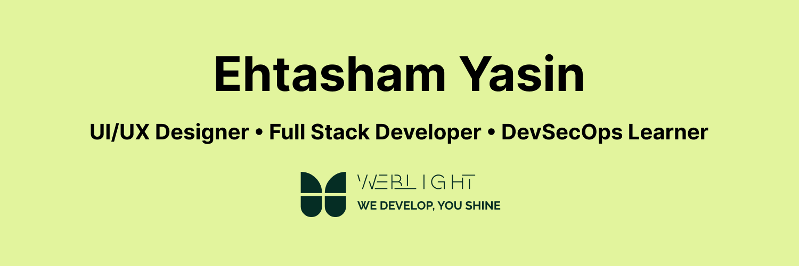

  

# Ehtasham Yasin
### Full-Stack Developer • AI & Automation Engineer • DevOps Enthusiast

##  About Me

Full-Stack Developer and AI & Automation Engineer with more than four years of frontend development experience and growing expertise in backend systems, DevOps, cloud technologies, and open-source development.
I build scalable web applications, API-driven systems, AI-powered solutions, and automated workflows using React, Next.js, Node.js, Python, Docker, and n8n.

## Current Focus

-  Building production-ready full-stack applications
-  Developing AI-powered tools and automation workflows
-  Learning DevOps, cloud infrastructure, and deployment
-  Exploring application security and DevSecOps practices
-  Contributing to open-source projects

## Tech Stack

###  Frontend

###  Backend

###  Databases

###  DevOps & Tools

##  Featured Projects

###  Full-Stack Web Applications
Modern responsive applications built with scalable frontend and backend architecture.

###  AI & Automation Projects
AI-powered tools and automated workflows designed to reduce repetitive work and improve productivity.

###  DevOps Projects
Containerized applications, deployment workflows, Docker environments, and CI/CD practice.

##  Currently Learning

- Kubernetes
- CI/CD Pipelines
- Cloud Architecture
- DevSecOps Practices
- Backend System Design
- AI Engineering & Automation

## 📊GitHub Analytics

##  GitHub Contribution & Activity

### Contribution Streak

### Contribution Activity

##  GitHub Achievements

##  Let's Connect

## Contribution Snake

### ⚡ Philosophy
> “Small consistent improvements create extraordinary results.”

