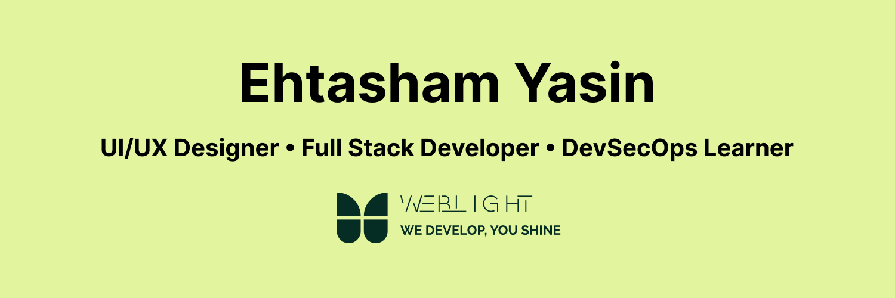

  

# Ehtasham Yasin
### Full-Stack Developer • AI & Automation Engineer • DevOps Enthusiast

##  About Me

Full-Stack Developer and AI & Automation Engineer with more than four years of frontend development experience and growing expertise in backend systems, DevOps, cloud technologies, and open-source development.
I build scalable web applications, API-driven systems, AI-powered solutions, and automated workflows using React, Next.js, Node.js, Python, Docker, and n8n.

## Current Focus

-  Building production-ready full-stack applications
-  Developing AI-powered tools and automation workflows
-  Learning DevOps, cloud infrastructure, and deployment
-  Exploring application security and DevSecOps practices
-  Contributing to open-source projects

## Tech Stack

###  Frontend

###  Backend

###  Databases

###  DevOps & Tools

##  Featured Projects

###  Full-Stack Web Applications
Modern responsive applications built with scalable frontend and backend architecture.

###  AI & Automation Projects
AI-powered tools and automated workflows designed to reduce repetitive work and improve productivity.

###  DevOps Projects
Containerized applications, deployment workflows, Docker environments, and CI/CD practice.

##  Currently Learning

- Kubernetes
- CI/CD Pipelines
- Cloud Architecture
- DevSecOps Practices
- Backend System Design
- AI Engineering & Automation

##  GitHub Contribution & Activity

### Contribution Streak

##  GitHub Achievements

View my [GitHub achievements](https://github.com/Ehtasham-Yasin?tab=achievements).

##  Let's Connect

## Contribution Snake

### ⚡ Philosophy
> “Small consistent improvements create extraordinary results.”

## Contributing to

- [kubeflow/pipelines-components](https://github.com/kubeflow/pipelines-components)
- [WordPress/presence-api](https://github.com/WordPress/presence-api)
- [python/mypy](https://github.com/python/mypy)
- [libredb/libredb-studio](https://github.com/libredb/libredb-studio)
- [opendatahub-io/notebooks](https://github.com/opendatahub-io/notebooks)
- [saleor/saleor-dashboard](https://github.com/saleor/saleor-dashboard)
- [trezor/trezor-suite](https://github.com/trezor/trezor-suite)
- [cilium/tetragon](https://github.com/cilium/tetragon)
- [paperclipai/paperclip](https://github.com/paperclipai/paperclip)
- [mermaid-js/mermaid](https://github.com/mermaid-js/mermaid)
- [OneUptime/oneuptime](https://github.com/OneUptime/oneuptime)
- [dynatrace-oss/koney](https://github.com/dynatrace-oss/koney)
- [github/spec-kit](https://github.com/github/spec-kit)
- [mermaid-js/mermaid-live-editor](https://github.com/mermaid-js/mermaid-live-editor)
- [melihbirim/csvql](https://github.com/melihbirim/csvql)
- [storyblok/monoblok](https://github.com/storyblok/monoblok)
- [ednity-discord/projet-commun](https://github.com/ednity-discord/projet-commun)
- [homayounmmdy/svg-world-maps](https://github.com/homayounmmdy/svg-world-maps)
- [off-on-dev/open-source-challenges](https://github.com/off-on-dev/open-source-challenges)
- [actualbudget/actual](https://github.com/actualbudget/actual)
- [simion/termic](https://github.com/simion/termic)
- [agentguard-ai/tealtiger-typescript-prod](https://github.com/agentguard-ai/tealtiger-typescript-prod)
- [Bike4Mind/bike4mind](https://github.com/Bike4Mind/bike4mind)
- [AshayK003/nse-sentiment-analyzer](https://github.com/AshayK003/nse-sentiment-analyzer)
- [Panniantong/Agent-Reach](https://github.com/Panniantong/Agent-Reach)
- [codecrafters-io/build-your-own-x](https://github.com/codecrafters-io/build-your-own-x)
- [firstcontributions/first-contributions](https://github.com/firstcontributions/first-contributions)
- [barchart/log4js-node-appenders](https://github.com/barchart/log4js-node-appenders)
- [tirth8205/code-review-graph](https://github.com/tirth8205/code-review-graph)
